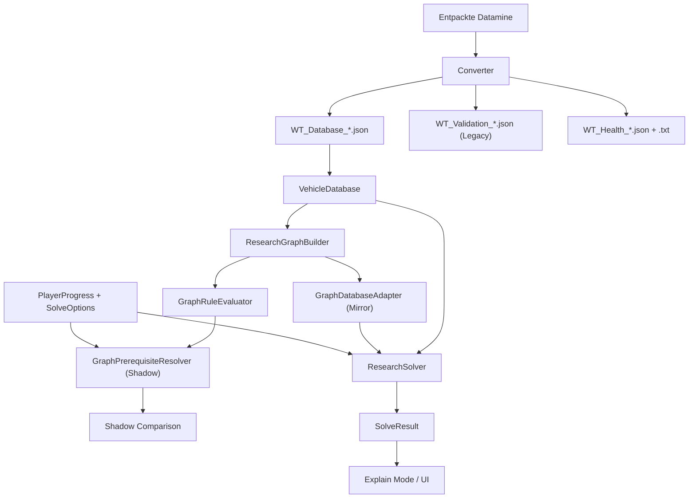

# Architecture

## Komponenten

| Bereich | Pfad | Verantwortung |
|---|---|---|
| Converter | `apps/datamine-manager/wurstbrot_converter.py` | Quelldateien finden, parsen, normalisieren, validieren und vergleichen |
| Core | `packages/core/wurstbrot_core/` | Datenmodell, Datenbankzugriff, GE-Regeln, Graph und Optimierer |
| Graph Foundation | `research_graph.py`, `graph_adapter.py` | typisiertes DAG-Modell, Diagnose, Export und Legacy-Adapter |
| Graph Semantics | `graph_semantics.py`, `graph_evaluation.py`, `graph_analysis.py` | Kantenvertrag, regelweise Eligibility-Auswertung, Mirror- und Sonderfallanalyse |
| Graph Resolution | `graph_resolution.py`, `graph_resolution_analysis.py` | eigenständige Voraussetzungsermittlung, Shadow-Vergleich und Progress-/Sonderfallmatrizen |
| Validator | `packages/validator/wurstbrot_validator/` | strukturierte Schema-, Graph-, Kosten- und Sonderfallprüfung |
| CLI | `apps/ge-calculator/ge_calculator_cli.py` | Argumente in Core-Modelle übersetzen und Explain Mode ausgeben |
| Desktop | `apps/ge-calculator/ge_calculator_gui.py` | Tkinter-Bedienoberfläche über dem Core |
| Daten | `data/samples/` | versionierte Beispieldatenbank für Entwicklung und Tests |
| Tests | `tests/` | Unit Tests und breite Graph-Regression |

## Datenfluss

## Abhängigkeitsregel

Der Core kennt keine UI, keine Argumentparser und keine Tkinter-Typen. Oberflächen dürfen den Core
importieren; der Core darf Oberflächen nicht importieren. Der Converter erzeugt das vereinbarte
JSON-Schema, importiert aber den Calculator-Core derzeit nicht.

## Wichtige Grenzen

- `VehicleDatabase` prüft Schema-Version, IDs, Vorgänger und Zyklen beim Laden.
- `ResearchSolver` bearbeitet genau einen `countryId`/`branchId`-Baum pro Aufruf.
- Der Forschungsgraph besitzt pro Fahrzeug höchstens einen direkten Vorgänger.
- Fahrzeuggruppen werden als sequenzielle Kette normalisiert.
- Rangoptimierung ist eine Uniform-Cost-Suche mit einem Sicherheitslimit von 75.000 Zuständen.
- Das parallele `ResearchGraph` bewahrt Vehicle-, Folder-, Unlock- und Rank-Knoten sowie typisierte
  Kanten. Es ersetzt den Solver noch nicht.
- Der Mirror-Adapter ändert nur die Closure-Quelle. Alle übrigen Solverzugriffe bleiben Legacy-Reads.
- `GraphRuleEvaluator` liest Graph, Fortschritt und Optionen, erzeugt aber weder Kosten noch eine
  Kandidatenauswahl. Der produktive Pfad bleibt `VehicleDatabase` → `ResearchSolver`.
- `GraphPrerequisiteResolver` ergänzt eindeutig notwendige Fahrzeugvoraussetzungen. Fehlende
  Rangkombinationen bleiben ohne expliziten Compatibility Mode unresolved.
- Die isolierte `LegacyRankCompatibilityStrategy` delegiert nur für Shadow-Vergleiche an die
  unveränderte bestehende Rangwahl. Sie ist kein neuer Optimizer.
- Produktiver Legacy-Solver, CLI, Desktop und Browser rufen den Graph Resolver nicht auf.

## Geplante Evolution

Die Browser-Implementierung soll dieselbe Fachlogik nutzen oder gegen dieselben Contract Tests laufen.
Eine zweite, still abweichende Berechnungslogik ist zu vermeiden.
