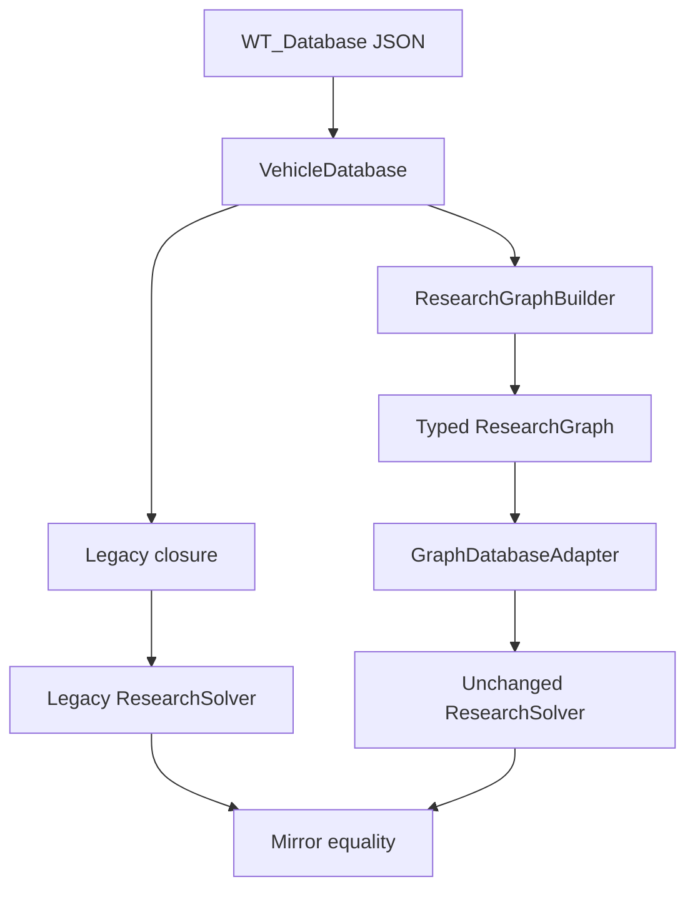

# Graph Engine Foundation

## Zweck und Status

Diese Schicht ist eine interne Architekturgrundlage. Sie verändert keine Berechnung und ersetzt den
bestehenden `ResearchSolver` nicht. `ResearchGraphBuilder` erzeugt parallel zum Schema-v1-Modell einen
typisierten gerichteten Graphen. `GraphDatabaseAdapter` stellt dem unveränderten Solver dieselbe
Datenbankschnittstelle bereit und löst ausschließlich Vorgänger-Closures über Graphkanten auf.

## Analysierter Datenfluss

Der Legacy-Pfad bleibt produktiv. Der Mirror-Pfad ist derzeit Test- und Analyseinfrastruktur.

## Aktuelle Solverrepräsentation

- `VehicleDatabase.vehicles` ist die ID-auf-Fahrzeug-Map.
- `predecessors[id]` enthält höchstens genau eine Vorgänger-ID oder `null`.
- `VehicleDatabase.closure(id)` läuft rückwärts als lineare Kette und kehrt das Ergebnis um.
- `ResearchSolver.solve()` bildet den direkten Pflichtpfad aus `closure(target)` minus Besitz.
- Besitz und Startfahrzeug erweitern den überwundenen Bestand jeweils um ihre lineare Closure.
- Rank-Unlock-Kandidaten werden als Fahrzeuge gewählt und jeweils um ihre lineare Closure ergänzt.
- `groups` beeinflusst den Solver nicht mehr direkt: Der Converter hat Folder-Reihenfolge bereits in
  `predecessors` normalisiert. Die Graphschicht bewahrt Folder zusätzlich als explizite Struktur.
- `rankUnlock[country][branch][rank]` ist eine Anzahl regulärer Fahrzeuge, die den folgenden Rang
  freischaltet. Der Legacy-Solver löst diese Schranke über eine Uniform-Cost-Suche.

## Identifizierte lineare Annahmen

| Stelle | Annahme | Folge |
|---|---|---|
| Datamine-Schema `predecessors` | höchstens ein Vorgänger | AND-/OR-Voraussetzungen sind nicht ausdrückbar |
| `VehicleDatabase._validate_cycles()` | genau eine nächste Rückwärtskante | Zyklusprüfung folgt einer Kette statt allgemeiner Adjazenz |
| `VehicleDatabase.closure()` | eindeutiger Wurzel-Ziel-Pfad | Closure ist ein Tupel, keine Teilordnung |
| direkter Zielpfad im Solver | eine Closure beschreibt alle Pflichtvorgänger | verzweigte Voraussetzungen wären unvollständig |
| `_expanded_owned()` | Besitz impliziert eine lineare Closure | mehrere Pflichtäste könnten fehlen |
| Startfahrzeugbehandlung | eine Start-Closure ist überwunden | keine zusammengesetzten Unlockbedingungen |
| Rank-Kandidatensuche | jeder Kandidat bringt eine lineare Closure mit | Mehrfachvorgänger sind nicht bewertbar |
| Converter-Foldernormalisierung | Folder-Mitglieder werden sequenziell | Foldersemantik ist nicht unabhängig lösbar |
| Browser-`closure()` | identische lineare Map | Browser übernimmt dieselbe Modellgrenze |
| breite Regression | Ziel startet mit seinem direkten Einzelvorgänger | 49 Sonderfälle bleiben separat |

## Typisiertes Graphmodell

Knoten-IDs sind durch Typpräfixe kollisionsfrei. Alle Kanten zeigen von Voraussetzung oder Struktur
zum abhängigen Fahrzeug.

| Knotentyp | Bedeutung |
|---|---|
| `vehicle` | normalisiertes Fahrzeug |
| `folder` | explizite Fahrzeuggruppe mit geordneter Mitgliedschaft |
| `unlock` | externer `reqUnlock`-Bezeichner; Semantik bleibt unbekannt |
| `rank` | Rangschranke von Quellrang zu folgendem Zielrang |

| Kantentyp | Richtung | Bedeutung |
|---|---|---|
| `predecessor` | Vorgänger → Fahrzeug | direkte Forschungsabhängigkeit |
| `folder` | Folder → Fahrzeug | geordnete Mitgliedschaft, keine zusätzliche Kaufregel |
| `unlock` | Unlock → Fahrzeug | externe Voraussetzung, noch nicht lösbar |
| `rank_requirement` | Rank-Knoten → Fahrzeug des Folgerangs | Zuordnung einer Kaufschranke |

Das Modell erlaubt mehrere `predecessor`-Kanten. Der Legacy-Adapter lehnt diese bewusst ab, weil der
alte Solver keine AND-/OR-Semantik besitzt. Damit unterstützt das Modell zukünftige Daten, ohne heute
eine nicht belegte Spielregel zu erfinden.

## Warum DAG, Adapter und Mirror Validation

Forschungsvoraussetzungen müssen vor ihrem abhängigen Fahrzeug erfüllbar sein. Ein DAG ermöglicht
topologische Reihenfolge, Closure über mehrere Äste und eindeutige Zyklusdiagnose. Ein Zyklus macht
eine endliche Freischaltungsreihenfolge unmöglich. Der Builder kann einen fehlerhaften Graphen für
Diagnosezwecke darstellen; `diagnostics.isDag` ist nur bei null Zykluskomponenten wahr.

Eine direkte Solvermigration würde Architektur und Rechenergebnis gleichzeitig ändern. Der Adapter
trennt beides: Fahrzeugdaten, Rank-Unlocks und Sortierung werden weiterhin von `VehicleDatabase`
gelesen; nur `closure()` kommt aus `ResearchGraph`.

Die breite Python-Regression berechnet jeden der 1.977 regulären Fälle zweimal: einmal mit
`VehicleDatabase`, einmal mit `GraphDatabaseAdapter`. Vollständige `SolveResult`-Objekte müssen gleich
sein. Fahrzeugzeilen, Gründe, Ranganforderungen und Warnungen sind damit Teil des Vertrags.

## Diagnostikdefinitionen

| Wert | Exakte Berechnung |
|---|---|
| Nodes/Edges | Anzahl der kanonisch sortierten Knoten beziehungsweise Kanten |
| Root Nodes | Knoten mit Eingangsgrad 0 über alle Kantentypen |
| Leaf Nodes | Knoten mit Ausgangsgrad 0 über alle Kantentypen |
| Folder/Unlock Nodes | Anzahl nach Knotentyp |
| Disconnected Components | schwach zusammenhängende Komponenten; Richtung wird ignoriert |
| Cycles | zyklische stark zusammenhängende Komponenten inklusive Selbstkanten |
| Longest Path | maximale Kantenzahl eines gerichteten Pfads; bei Zyklen `null` |
| Average Branching Factor | `edgeCount / Anzahl Knoten mit mindestens einer Ausgangskante` |

Die Werte beziehen alle vier Knoten- und Kantentypen ein. Sie beeinflussen keine Kostenberechnung.

## Sample-Diagnostik 2.57.1.67

| Kennzahl | Wert |
|---|---:|
| Nodes | 3.098 |
| Edges | 4.746 |
| Vehicle Nodes | 2.232 |
| Folder Nodes | 395 |
| Unlock Nodes | 21 |
| Rank Nodes | 450 |
| Root Nodes | 962 |
| Leaf Nodes | 815 |
| Disconnected Components | 351 |
| Cycles | 0 |
| Longest Path | 18 |
| Average Branching Factor | 2,078844 |

## Debug-Export

`ResearchGraph.write_json(path)` schreibt Schema-Version 1, Spielversion, deterministisch sortierte
Knoten und Kanten sowie Diagnostik. Der Export ist ausschließlich für Tests und Analyse vorgesehen;
es gibt keine GUI- oder Browserintegration.

## Bewusste Grenzen

- Der Adapter kann weiterhin nur genau einen Vorgänger je Fahrzeug an den Legacy-Solver liefern.
- Folder-Kanten sind Mitgliedschaft, nicht automatisch eine Freischaltungsregel.
- `reqUnlock` wird als externer Knoten bewahrt, aber nicht interpretiert.
- Rank-Kanten ordnen eine Schranke Fahrzeugen des Folgerangs zu; sie wählen keine Kaufkombination.
- Event, Squadron und Legacy bleiben durch das normalisierte Schema teilweise zusammengefasst.
- Die 49 bekannten Sonderfälle sind noch nicht Bestandteil der breiten Mirror-Matrix.
- Kein Graph Solver, Optimizer-, Explain- oder Performanceumbau ist Teil dieses Sprints.
